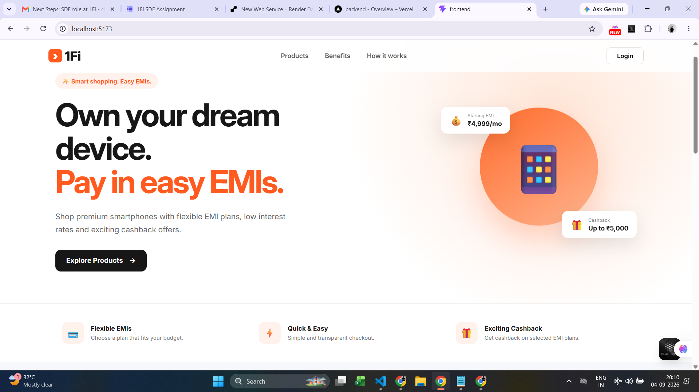
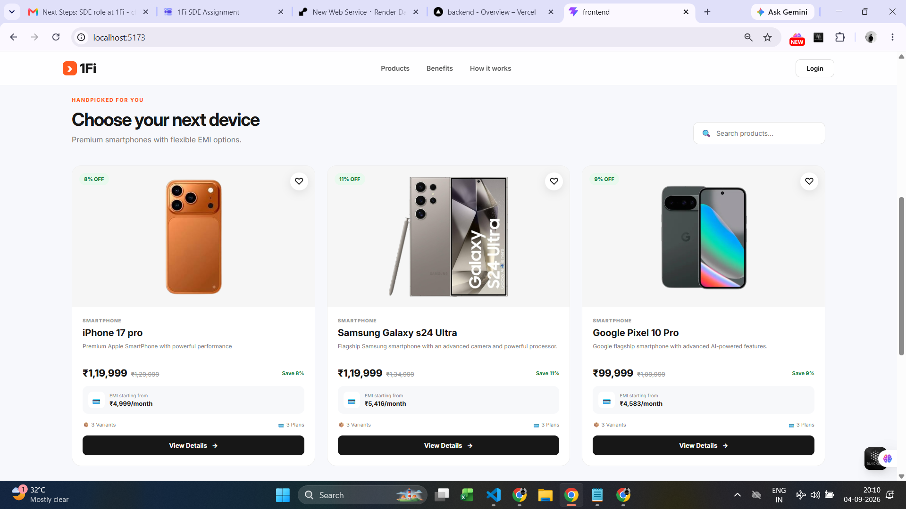
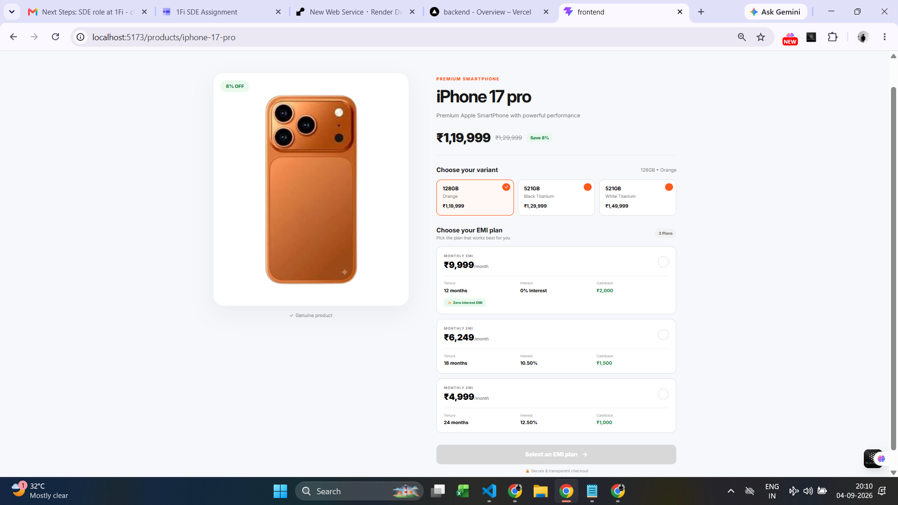
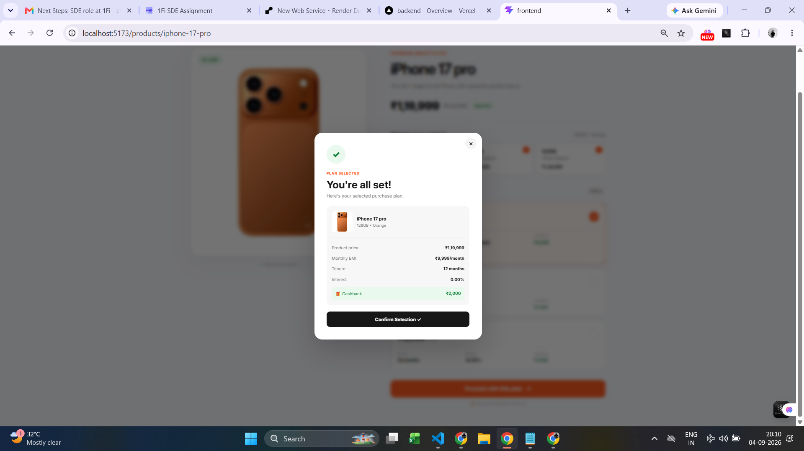
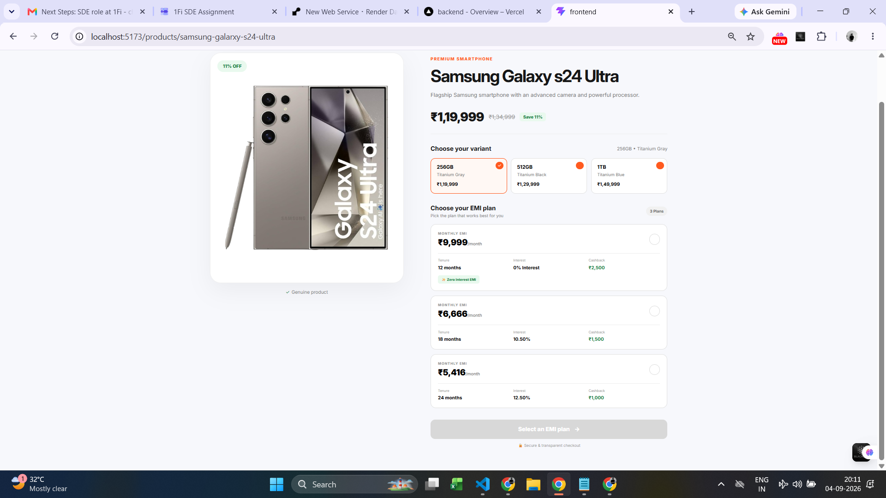
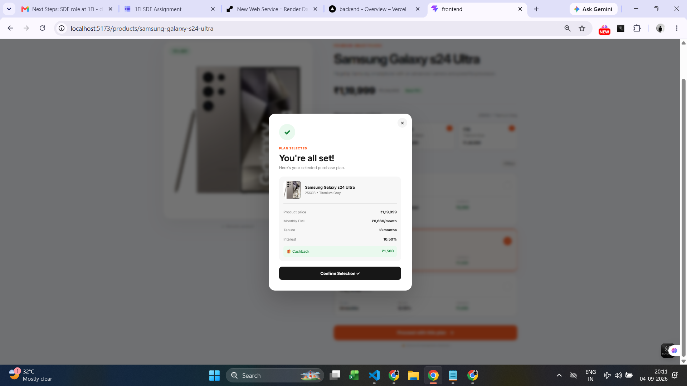
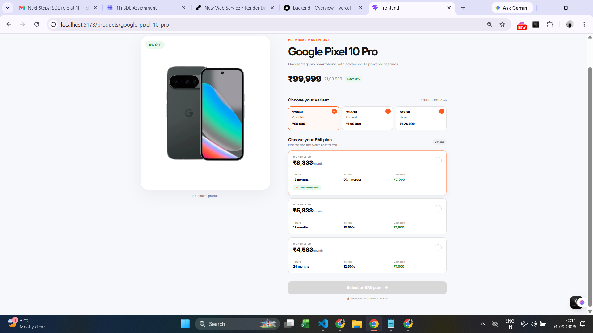
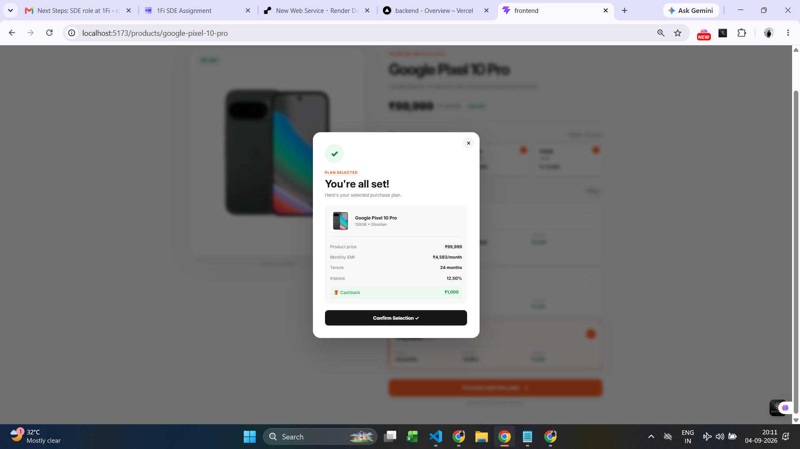

# 1Fi EMI Shopping Platform

A full-stack EMI-based shopping platform built for the 1Fi SDE1 assignment.

Users can browse smartphones, select product variants, compare EMI plans, and proceed with their preferred EMI option.

## 🚀 Features

- Product listing
- Product search
- Product details
- Multiple product variants
- MRP and selling price
- EMI plans
- Interest rate and cashback
- Variant selection
- EMI plan selection
- Responsive UI
- Dynamic API-driven data

## 🛠️ Tech Stack

### Frontend
- React 19
- Vite
- JavaScript
- React Router
- CSS

### Backend
- Python
- Django
- Django REST Framework
- Django ORM

### Database
- PostgreSQL

### Tools
- Git
- GitHub
- VS Code
- Postman

## 🏗️ Architecture

```text
React Frontend
      ↓
Django REST API
      ↓
Django ORM
      ↓
PostgreSQL
````

## 📱 Products

The application currently contains:

* iPhone 17 Pro
* Samsung Galaxy S24 Ultra
* OnePlus 13

Each product has multiple variants and EMI plans.

## 🔌 API Endpoints

### Get All Products

```http
GET /api/products/
```

### Get Product Details

```http
GET /api/products/<slug>/
```

Example:

```http
GET /api/products/iphone-17-pro/
```

## 🗄️ Database

The database contains three main models:

```text
Products
   ├── Variants
   └── EMI Plans
```

### Products

* name
* slug
* description
* image

### Variants

* storage
* color
* MRP
* price

### EMI Plans

* monthly payment
* tenure
* interest rate
* cashback

## ⚙️ Setup

### Backend

```bash
cd backend
python -m venv test
test\Scripts\activate
pip install django djangorestframework django-cors-headers psycopg2-binary
cd emi
python manage.py migrate
python manage.py seed_data
python manage.py runserver
```

Backend:

```text
http://127.0.0.1:8000/
```

### Frontend

```bash
cd frontend
npm install
npm run dev
```

Frontend:

```text
http://localhost:5173/
```

## 📸 Screenshots














## 🚀 Project Status

* Frontend: ✅
* Backend: ✅
* PostgreSQL: ✅
* REST APIs: ✅
* Seed Data: ✅
* EMI Selection: ✅
* Responsive UI: ✅

## 👨‍💻 Author

**Abbireddy Venkata Chandu**

GitHub:
[https://github.com/venkat-0706](https://github.com/venkat-0706)

## 📜 License

Apache License 2.0

